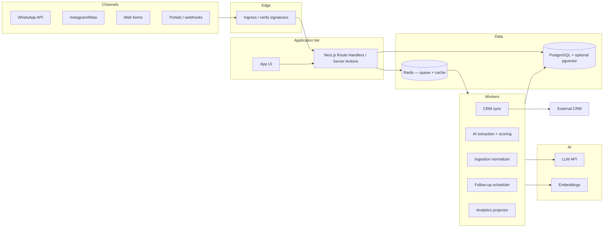
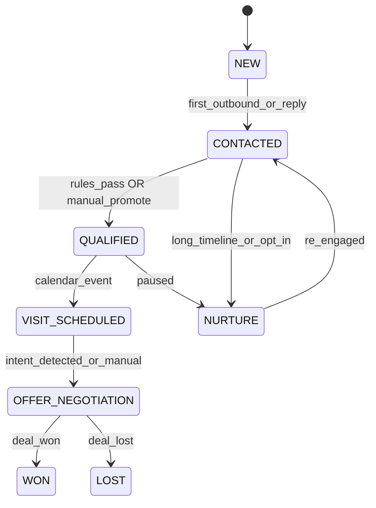

# Product architecture — Real estate agency sales infrastructure

This document defines an **implementation-oriented** architecture for a **premium, multi-tenant** platform: lead ingestion → qualification → recommendations → follow-up → CRM-aligned state → analytics → lost-opportunity visibility, with **human handoff** and **quality controls**.

**Stack assumptions:** Next.js (App Router), TypeScript, PostgreSQL, Prisma, background workers (queue), LLM for structured extraction, optional pgvector for embeddings.

---

## 1. High-level system architecture

### 1.1 Topology

We use a **modular monolith** first: one deployable **web + API** (Next.js) and **separate worker process(es)** consuming the same database and queue. This optimizes **velocity** and **transactional consistency** while keeping **async** work off the request path.



**Why this shape**

- **Next.js** owns **auth**, **UI**, and **synchronous** mutations that must return fast (assign lead, approve draft, move stage).
- **Workers** own **retries**, **LLM latency**, **CRM rate limits**, and **scheduled** follow-ups—never block HTTP on these.
- **PostgreSQL** is the **source of truth** for pipeline and messages; **Redis** (or managed equivalent) backs **BullMQ** / similar for **at-least-once** jobs with **idempotency keys** stored in Postgres.

### 1.2 Trust boundaries

| Layer | Responsibility |
|-------|----------------|
| **Ingress** | Verify webhook signatures, parse payload, **enqueue** raw event with idempotency key—minimal logic. |
| **Domain services** | Normalize to internal schema, enforce **tenant** isolation, **stage** rules, **approval** gates. |
| **Workers** | AI calls, CRM sync, scheduled sends, **analytics** emission, **vector** upserts. |
| **Read models** | API reads from Postgres; **funnel/lost** views query **materialized** tables or indexed `analytics_events`—not ad-hoc joins on raw logs in hot paths. |

---

## 2. Main product modules

| Module | Responsibility |
|--------|------------------|
| **Tenancy & auth** | Agencies, users, roles (admin / agent), **channel connections** (OAuth tokens, phone IDs). |
| **Lead ingestion** | Adapters per channel → `InboundEvent` → `Message` + `Conversation` + `Lead` upsert. |
| **Qualification** | Structured profile (`LeadProfile` JSON), **score**, **confidence**, **next action**; rules engine + LLM. |
| **Property catalog** | Listings (owned or synced); **embedding** rows for similarity; freshness flags. |
| **Recommendation** | Rank + explain; **tradeoffs**; **grounded** in listing IDs. |
| **Follow-up** | Policies (cadence, quiet hours), **task** generation, optional **draft** outbound messages. |
| **CRM bridge** | Mapping internal `PipelineStage` ↔ external CRM; **sync** jobs; conflict policy. |
| **Messaging controls** | Approval queues for outbound, **template versioning**, **blocklists**, rate limits. |
| **Analytics & lost opportunities** | Event stream + **projections**: stale, ghosted, stage dwell, source quality. |
| **Human handoff** | Escalation triggers, assignment, **notes**; **AI** never silently overwrites broker-owned fields without policy. |

---

## 3. Core entities / data model

### 3.1 Tenancy

- **`Agency`**: billing, settings (timezone, default SLA hours, approval mode).
- **`User`**: belongs to agency; role `AGENCY_ADMIN` | `AGENT` (extend later).
- **`ChannelConnection`**: `type` (WHATSAPP, INSTAGRAM, WEB_FORM, PORTAL, …), encrypted credentials reference, `external_account_id`, `status`.

### 3.2 Pipeline & leads

- **`Lead`**: `agencyId`, `primaryConversationId?`, `stage` (enum below), `ownerUserId?`, `source` (channel + metadata), `archivedAt?`, **profile** stored as structured columns + `profileJson` for flexibility during iteration.
- **`LeadStage`** (recommended enum): `NEW` → `CONTACTED` → `QUALIFIED` → `VISIT_SCHEDULED` → `OFFER_NEGOTIATION` → `WON` | `LOST` | `NURTURE` (adjust names in Prisma with `@map`).

**Strong choice:** persist **high-value profile fields** as columns where you filter/sort often (`budgetMax`, `zoneIds[]`, `leadScore`, `urgency`), and keep **`profileJson`** for long-tail fields—avoids migration churn early while keeping indexes useful.

### 3.3 Conversations & messages

- **`Conversation`**: `agencyId`, `leadId`, `channelConnectionId`, `externalThreadId` (channel-native id), `lastMessageAt`, `unreadCount` (denormalized for inbox).
- **`Message`**: `conversationId`, `direction` (INBOUND | OUTBOUND), `body`, `sentAt`, `externalMessageId`, `senderType` (CONTACT | AGENT | SYSTEM), **`deliveryStatus`**, **`requiresApproval`** (bool), **`approvedByUserId`**, **`aiRunId?`** (nullable FK to trace).

Store **raw webhook payload** optionally in `InboundEvent.payload` (JSONB) for replay—**retention policy** per agency (compliance).

### 3.4 Tasks & follow-up

- **`Task`**: `leadId`, `type` (CALL, FOLLOW_UP_MESSAGE, VISIT_CONFIRM, CRM_UPDATE, …), `dueAt`, `status`, `assignedToUserId`, `payloadJson` (e.g. suggested draft id).

### 3.5 Listings & matches

- **`Listing`**: `agencyId`, `externalId?`, `addressSummary`, `price`, `currency`, `zoneId`, `propertyType`, `attrsJson`, `embeddingVector?` (pgvector), `availableUntil?`, `syncedAt`.
- **`PropertyMatch`**: `leadId`, `listingId`, `rank`, `fitScore`, `reasonsJson`, `tradeoffsJson`, `createdAt`—**immutable** snapshot for audit (“what we suggested then”).

### 3.6 CRM & notes

- **`CrmLink`**: `leadId`, `provider`, `externalDealId`, `externalContactId`, `lastSyncedAt`, `syncState`.
- **`Note`**: `leadId`, `authorUserId?`, `body`, `visibility`, `source` (MANUAL | AI_SUMMARY | SYSTEM)—**append-only** preferred for trust.

### 3.7 AI & quality

- **`AiRun`**: `type` (EXTRACT_PROFILE | SCORE_LEAD | RANK_LISTINGS | DRAFT_REPLY | SUMMARIZE_THREAD), `model`, `promptVersion`, `inputHash`, `outputJson`, `confidence`, `latencyMs`, `leadId?`, `messageId?`.
- **`MessagingPolicy`**: per `ChannelConnection` or agency: `requireApprovalForOutbound`, `autoSendMaxScore`, `quietHours`, `blockedTopics` (optional).

### 3.8 Events (analytics)

- **`AnalyticsEvent`**: append-only, `agencyId`, `leadId?`, `conversationId?`, `type` (see §4.2), `properties` (JSONB), `occurredAt`, **`idempotencyKey`** unique per agency for safe re-emit.

Optional: **`LeadStageHistory`** table for fast funnel and dwell-time queries (every transition with `from`, `to`, `at`, `actor`).

### 3.9 Recommended Prisma-style table list

| Table | Purpose |
|-------|---------|
| `agencies` | Tenant |
| `users` | Operators |
| `channel_connections` | OAuth / API creds metadata |
| `leads` | Pipeline + denormalized qual fields |
| `conversations` | Threads |
| `messages` | All messages + approval flags |
| `tasks` | Follow-ups |
| `listings` | Inventory + optional vector |
| `property_matches` | Suggestion history |
| `crm_links` | External IDs |
| `notes` | CRM-style notes |
| `ai_runs` | Audit + eval |
| `analytics_events` | Funnel + lost-opportunity inputs |
| `lead_stage_history` | Stage transitions (recommended) |
| `inbound_events` | Raw ingress for replay (optional but valuable) |

---

## 4. Main backend workflows

### 4.1 Inbound message (happy path)

1. **Webhook** hits **Route Handler** → verify signature → **insert `InboundEvent`** (or skip if duplicate `idempotency_key`).
2. **Enqueue** `processInboundEvent` job (**async**).
3. Worker: normalize → **upsert `Lead` + `Conversation` + `Message`** (inbound).
4. **Sync:** emit `analytics_events`: `message.inbound`, `lead.touched`.
5. **Enqueue** `runQualificationPipeline` (async)—see §5.
6. **Optional sync** response: channel adapter may need **200 OK** fast—never wait for LLM in HTTP handler.

**Sync vs async**

| Step | Sync (HTTP) | Async (worker) |
|------|-------------|----------------|
| Auth + verify + persist raw | ✓ | |
| Insert message row | ✓ (minimal) or defer all to worker* | ✓ preferred for uniformity |
| LLM extraction | | ✓ |
| CRM sync | | ✓ |
| Outbound auto-reply | | ✓ (if policy allows) |

*Strong choice: **minimal sync** write (event + ack), **heavy** write in worker—simpler idempotency; alternative is transactional message insert in API if latency OK.

### 4.2 Stage transitions

- **Rules engine** (code) evaluates guards: e.g. `QUALIFIED` requires `budgetMax`, `zoneIds`, `timelineBucket`.
- Transitions log **`lead_stage_history`** + emit `stage.changed` analytics event.
- **CRM sync job** reacts to `stage.changed` (async).

**Human approval:** moving to `OFFER_NEGOTIATION` or sending **contractual** content may require **agent** action—product policy, not model.

### 4.3 Follow-up automation

- **Scheduler worker** (cron or delayed jobs): finds leads matching **policy** (e.g. no reply 48h, stage `CONTACTED`).
- Creates **`Task`** or **`Message` draft** with `requiresApproval=true` if agency mandates approval for outbound.
- **Quiet hours:** scheduler enqueues **send** job for `nextAllowedAt`.

### 4.4 Lost opportunity & funnel analytics

- **Projector** (batch or incremental): reads `messages`, `lead_stage_history`, `tasks` → updates **`lead_health`** (materialized column or side table) e.g. `hours_since_outbound`, `is_stale`, `ghosted_after_visit`.
- **Dashboard APIs** query **precomputed** flags—avoid scanning all messages at request time.

### 4.5 Event catalog (stable names)

| Event `type` | When | Key `properties` |
|--------------|------|------------------|
| `lead.created` | New lead | `source`, `channel` |
| `message.inbound` / `message.outbound` | Persisted message | `direction`, `requiresApproval` |
| `stage.changed` | Transition | `from`, `to`, `actor` |
| `qualification.updated` | Profile/score change | `score`, `confidence` |
| `match.generated` | Matches stored | `listingIds`, `strategy` |
| `task.due` / `task.completed` | Task lifecycle | `taskType` |
| `visit.intent` / `visit.scheduled` | Product-specific | `slot` |
| `handoff.requested` | Escalation | `reason` |

---

## 5. AI pipelines

### 5.1 Qualification pipeline (async)

**Input:** latest N messages + `Lead` fields + channel metadata.  
**Output:** structured `LeadProfile` patch, `leadScore`, `confidence`, `recommendedNextAction`, optional `objections[]`.

**Steps**

1. **Deterministic pre-parse** (regex / locale): currency, phone—cheap.
2. **LLM structured extraction** (JSON schema / tool): budget, zones, type, timeline, financing, seriousness—**validate** with Zod; **reject** invalid numbers.
3. **Rules layer:** cap score, **disqualify** patterns (out of market)—**code** has veto.
4. **Persist** `AiRun` + update `leads` columns + `profileJson`.
5. If **confidence** low or **critical** fields missing → create **`Task`** (human) or **draft** clarifying message (policy).

**Eval / thresholds:** track per-version **field-level accuracy** on a golden set; **block** prompt deploy if regression > agreed tolerance.

### 5.2 Property recommendation (async)

**Input:** `LeadProfile` + candidate listings (SQL filter + top-K by embedding optional).  
**Output:** ordered `PropertyMatch[]` with **reasons** and **tradeoffs**.

**Steps**

1. **Hard filter** in SQL (price band, zone, type).
2. **Soft score** in code (weights); optional **vector** similarity on listing + buyer “intent text.”
3. **LLM** generates **short rationale** only for top 3–5—**grounded** listing IDs passed in context; **forbid** inventing specs.
4. **Persist** `property_matches` snapshot.

**Confidence:** if **no** listings pass hard filter → **fallback** object (`widen_budget`, etc.)—no fake listings.

### 5.3 Draft reply & messaging quality

**Input:** thread context + policy + `MessagingPolicy`.  
**Output:** `Message` draft, `requiresApproval=true` by default for **premium** positioning until agency opts in to auto-send under **score + template** caps.

**Human approval matrix (recommended default)**

| Outbound type | Auto-send OK when |
|---------------|-------------------|
| Simple acknowledgment | Policy + high trust score + template slot |
| Listing suggestions | Often **approval** or **high** `leadScore` + whitelist |
| Scheduling / legal / price discussion | **Always human** |

### 5.4 Vector search (optional MVP / Phase 2)

- **Conversations:** embed **buyer intent** summary per `Lead` for “similar deals” in lost-opportunity analysis (Phase 2).
- **Listings:** pgvector on `listings.embedding` for **semantic** match when structured filters are soft.

### 5.5 Sync vs async summary (AI)

| Operation | Path |
|-----------|------|
| Ingest ACK | Sync |
| Extract + score | Async |
| Rank + explain | Async |
| Draft message | Async (then sync **display** in UI) |
| Auto-send | Async + gated |

---

## 6. State transitions (lead)



**AI influence:** proposes **candidates** for stage; **code + human** commit. **Never** LLM-only transition to `WON`/`LOST`.

---

## 7. Recommended folder / code architecture

**Option A — single Next.js app (fastest MVP)**

```
apps/web/   # or repo root
  app/                    # App Router: (dashboard), (marketing), api/
  lib/
    domain/               # Pure TS: stage guards, scoring math
    services/             # LeadService, MessageService—orchestration
    integrations/
      whatsapp/
      meta/
      crm/
        hubspot.ts
    ai/
      prompts/
      schemas/            # Zod for LLM outputs
      pipelines/
        qualify.ts
        recommend.ts
    analytics/
    jobs/                 # job handlers (imported by worker)
  prisma/
    schema.prisma
  worker.ts               # entry: BullMQ consumers (or packages/worker)
```

**Option B — monorepo (scale)**

- `apps/web`, `apps/worker`, `packages/db` (Prisma client + schema), `packages/shared` (types, zod schemas).

**Strong choice for MVP:** **Option A** with **`worker.ts`** second entry in same package—deploy **two** processes from one repo (VPS, Railway, Fly, etc.).

---

## 8. MVP scope

**In**

- **Multi-tenant** agencies + users; **RBAC** minimal (admin vs agent).
- **One primary channel** end-to-end (recommend **WhatsApp** or **web form** first—fastest to control UX).
- **Lead + conversation + message** storage; **inbound** webhooks + **idempotency**.
- **Qualification v1:** LLM structured extraction + **rules** + **`LeadStage`** + **`leadScore`** + **`AiRun`** audit.
- **Listing** manual CSV or simple CRUD + **recommendation** without vectors **or** with simple SQL-only rank.
- **Tasks** for follow-ups; **scheduler** for one **cadence** (e.g. 48h nudge).
- **CRM:** **optional** Phase 1.5—if required Day 1, ship **one** provider with **deal + note** sync only.
- **Dashboard:** inbox + lead detail + **stale** definition (time since last **outbound** or stage dwell).
- **Messaging controls:** **approval queue** for outbound drafts; **template version** in `AiRun` / policy.
- **Analytics events** for core funnel + **lost list** query (stale/ghosted **v1** rules).

**Out (explicit non-goals for MVP)**

- Full Instagram + portals + WhatsApp **all** at once.
- Full **bi-directional** CRM conflict resolution UI.
- Advanced **embedding** search across all conversations.
- Multi-language **content** beyond one locale unless required.

---

## 9. Phase 2 roadmap

| Theme | Deliverables |
|-------|----------------|
| **Channels** | Instagram DM, additional portals; unified **normalization** layer. |
| **CRM depth** | Full field mapping, **conflict** UI, **activity** sync back. |
| **Vectors** | Listing embeddings + **semantic** buyer match; optional **conversation** clustering for coaching. |
| **Lost opportunities v2** | ML or rule-based **health score**; **reason codes** (price, timing, competitor); manager **alerts**. |
| **Eval platform** | Dataset registry, **prompt** versioning, **CI** checks on extraction quality. |
| **Voice / calls** | If needed: call logging integration, **transcript** → qualification. |
| **Billing** | Stripe usage per agency, **seat** limits. |

---

## 10. Summary of strong choices

1. **Postgres source of truth**; **queue** for anything with **retries**, **LLM**, or **CRM**.
2. **Denormalize** hot qualification fields **on `Lead`**; keep JSON for agility—**migrate** to columns as queries stabilize.
3. **`AiRun` + Zod** for every model output; **rules veto** bad LLM data.
4. **Default human approval** for outbound until policy proves **safe** with **score + template** gates.
5. **`AnalyticsEvent` + `lead_stage_history`** enable **funnel** and **dwell** without scraping messages at read time.
6. **PropertyMatch** snapshots for **audit** (“what we suggested”).
7. **Idempotency** everywhere: webhooks, sends, analytics emit.

---

*Document version: 1.0 — align with `.cursor/rules` and implementation; revise when first CRM and channels are fixed.*
