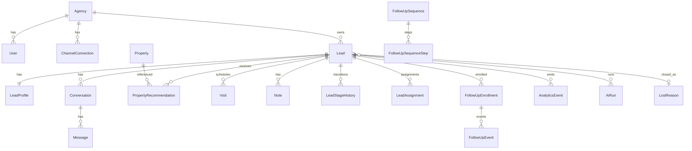

# Domain model & database schema (v1)

This document defines the **first-pass relational model** for the real estate AI sales platform. It extends [`ARCHITECTURE.md`](./ARCHITECTURE.md) with **entity purposes**, **relationships**, **lifecycle notes**, a **Prisma** proposal, **indexes**, **JSON vs normalized** fields, and **likely migrations**.

**Principles:** **multi-agency isolation** (`agencyId` on tenant-owned rows), **auditable** AI and recommendations, **append-only** analytics-friendly events, **CRM**-aligned stages with **history**, **lost-opportunity** explainability.

---

## 1. Entity reference

### 1.1 `Agency`

| | |
|--|--|
| **Purpose** | Tenant root: billing, branding settings, default SLAs, messaging policies. |
| **Important fields** | `id`, `name`, `slug` (unique), `timezone`, `settings` (JSON: quiet hours, approval defaults), `createdAt` |
| **Relationships** | 1→N `User`, `ChannelConnection`, `Lead`, `Property`, `FollowUpSequence`, `LostReason` (custom), etc. |
| **Lifecycle** | Created at signup; soft-delete or `status` if churn (add when billing exists). |

---

### 1.2 `User`

| | |
|--|--|
| **Purpose** | Operators (agents, admins) who log into the app; **assignment** targets. |
| **Important fields** | `id`, `agencyId`, `email` (unique per agency or global—pick one), `name`, `role` (`AGENCY_ADMIN` \| `AGENT`), `avatarUrl?`, `lastSeenAt?` |
| **Relationships** | N→1 `Agency`; 1→N `Lead` as `ownerUserId`; auth session provider IDs in separate table if needed (Out of scope here). |
| **Lifecycle** | Invite → active → deactivated (`deactivatedAt`). |

---

### 1.3 `ChannelConnection` (channels)

| | |
|--|--|
| **Purpose** | One **logical channel** instance per agency (e.g. WhatsApp Business number, Meta page, form endpoint). Credentials live in vault/KMS—store **reference** only. |
| **Important fields** | `id`, `agencyId`, `type` (enum), `label`, `externalAccountId`, `status` (ACTIVE \| ERROR \| DISCONNECTED), `metadata` (JSON: phone display, page name), `encryptedCredentialsRef?` |
| **Relationships** | 1→N `Conversation`; optional default for `Lead.sourceChannelId`. |
| **Lifecycle** | OAuth/connect → ACTIVE; token refresh failures → ERROR; user disconnect → DISCONNECTED. |

---

### 1.4 `Lead`

| | |
|--|--|
| **Purpose** | The **commercial object** in the pipeline: one buyer/seller thread of work, **scoped** to an agency. Holds **current stage**, **owner**, **denormalized score** for fast lists. |
| **Important fields** | `id`, `agencyId`, `primaryConversationId?`, `stage` (`LeadStage` enum), `ownerUserId?`, `source` (JSON: channel, campaign, portal id), `archivedAt?`, **sort/filter columns:** `leadScore`, `budgetMin`, `budgetMax`, `currency`, `urgency`, `zoneIds` (Postgres `text[]` or join table—see Prisma note), `lastActivityAt`, `closedAt?`, `lostReasonId?`, `lostNote?` |
| **Relationships** | 1→1 `LeadProfile`; 1→N `Conversation`, `LeadStageHistory`, `PropertyRecommendation`, `Note`, `Visit`, `Task`, `FollowUpEnrollment`, `LeadAssignment`, `AnalyticsEvent` (optional FK) |
| **Lifecycle** | Created on first inbound or form → stage `NEW` → … → `WON`/`LOST`/`NURTURE`; **lost** rows keep `lostReasonId` for analytics. |

---

### 1.5 `LeadProfile` (structured extraction + flexibility)

| | |
|--|--|
| **Purpose** | **Canonical store** for AI/rules **structured qualification**: versioned-friendly fields + **flex** JSON without exploding `Lead` columns on day one. |
| **Important fields** | `leadId` (PK/FK), `financingMode`, `timelineMonths?`, `propertyTypes` (enum[] or string[]), `seriousness`, `objections` (JSON array), `recommendedNextAction` (JSON: `{ type, detail, confidence }`), `extractionVersion`, `profileJson` (JSON: long-tail), `updatedAt` |
| **Relationships** | 1→1 `Lead` (same id as lead or separate id with unique leadId). |
| **Lifecycle** | Upserted whenever qualification pipeline runs; optional **history** via `AiRun` + periodic `LeadScoreSnapshot` if you need charts. |

**Strong choice:** **1:1** `LeadProfile` keeps `Lead` row narrower and clarifies “everything qualification-specific lives here” except **denormalized** list columns on `Lead`.

---

### 1.6 `Conversation`

| | |
|--|--|
| **Purpose** | **Per-channel thread** linked to a lead (multi-channel = multiple conversations, one lead). |
| **Important fields** | `id`, `agencyId`, `leadId`, `channelConnectionId`, `externalThreadId` (unique per channel connection), `lastMessageAt`, `unreadCount`, `status` (OPEN \| ARCHIVED) |
| **Relationships** | N→1 `Lead`, `ChannelConnection`; 1→N `Message` |
| **Lifecycle** | Created on first message; `lastMessageAt` / `unreadCount` updated on ingest. |

---

### 1.7 `Message`

| | |
|--|--|
| **Purpose** | **Immutable** (append-only) chat history for compliance and AI context; supports **approval** and **AI trace**. |
| **Important fields** | `id`, `conversationId`, `agencyId` (denorm for tenant-safe queries), `direction`, `body` (text), `sentAt`, `externalMessageId?`, `senderType`, `deliveryStatus`, `requiresApproval`, `approvedAt?`, `approvedByUserId?`, `aiRunId?`, `metadata` (JSON: attachments, template ids) |
| **Relationships** | N→1 `Conversation`; optional `AiRun` |
| **Lifecycle** | Insert on send/receive; **edits** rare—prefer new row or `supersededById` if regulations require. |

---

### 1.8 `Property` (listings / inventory)

| | |
|--|--|
| **Purpose** | **Sellable/rentable** units the agency can recommend—**grounding** for AI. |
| **Important fields** | `id`, `agencyId`, `externalId?`, `title`, `addressSummary`, `zoneId` / `zoneCode`, `price`, `currency`, `propertyType`, `bedrooms?`, `bathrooms?`, `attrs` (JSON), `status` (AVAILABLE \| UNDER_OFFER \| SOLD \| WITHDRAWN), `availableConfirmedAt?`, `embeddingUpdatedAt?` (if using vectors) |
| **Relationships** | 1→N `PropertyRecommendation` |
| **Lifecycle** | CRUD or sync from MLS/internal; status drives **match** eligibility. |

---

### 1.9 `PropertyRecommendation` (recommendation history)

| | |
|--|--|
| **Purpose** | **Immutable snapshot** of “what we suggested, when, why”—audit, analytics, **override** studies. |
| **Important fields** | `id`, `agencyId`, `leadId`, `propertyId`, `rank`, `fitScore`, `reasons` (JSON array), `tradeoffs` (JSON), `strategy`, `aiRunId?`, `createdAt` |
| **Relationships** | N→1 `Lead`, `Property`; optional `AiRun` |
| **Lifecycle** | New set inserted each generation run; **do not update** rows—append new batch linked to `aiRunId`. |

---

### 1.10 `FollowUpSequence` & `FollowUpSequenceStep`

| | |
|--|--|
| **Purpose** | **Definition** of automated cadences (e.g. “48h silence → nudge”, “day 3 check-in”). Steps are **ordered** with delays. |
| **Important fields (sequence)** | `id`, `agencyId`, `name`, `trigger` (enum: ON_STAGE_ENTER, ON_SILENCE, MANUAL), `triggerConfig` (JSON: e.g. `{ "stage": "CONTACTED", "silenceHours": 48 }`), `channelScope` (enum), `isActive` |
| **Important fields (step)** | `id`, `sequenceId`, `stepOrder`, `delayFromPreviousMs`, `actionType` (SEND_MESSAGE_DRAFT \| CREATE_TASK \| NOTIFY), `actionConfig` (JSON: template key, task type), `requiresApprovalDefault` |
| **Relationships** | 1→N steps; N→1 `FollowUpEnrollment` |
| **Lifecycle** | Version sequences by **cloning** or `version` field when editing live enrollments. |

---

### 1.11 `FollowUpEnrollment` & `FollowUpEvent`

| | |
|--|--|
| **Purpose** | **Enrollment** binds a **lead** to a **sequence** (state machine); **events** log each fired action for debugging and analytics. |
| **Important fields (enrollment)** | `id`, `agencyId`, `leadId`, `sequenceId`, `status` (ACTIVE \| PAUSED \| COMPLETED \| CANCELLED), `currentStepIndex`, `nextRunAt`, `startedAt`, `completedAt?` |
| **Important fields (event)** | `id`, `enrollmentId`, `agencyId`, `leadId`, `stepIndex`, `eventType` (SCHEDULED \| EXECUTED \| SKIPPED \| FAILED), `occurredAt`, `messageId?`, `taskId?`, `error?`, `metadata` (JSON) |
| **Relationships** | Enrollment N→1 `Lead`, `FollowUpSequence`; Event N→1 `FollowUpEnrollment` |
| **Lifecycle** | Scheduler advances `currentStepIndex` / `nextRunAt`; pause on **stage change** or **human** action per policy. |

---

### 1.12 `Note`

| | |
|--|--|
| **Purpose** | **CRM-style** free text + structured mentions; **append-only** preferred. |
| **Important fields** | `id`, `agencyId`, `leadId`, `authorUserId?`, `body`, `visibility` (TEAM \| PRIVATE), `source` (MANUAL \| AI_SUMMARY \| SYSTEM), `createdAt` |
| **Relationships** | N→1 `Lead`, `User` (author) |
| **Lifecycle** | Insert-only; “edit” = add correction note or soft policy (optional `supersededById` later). |

---

### 1.13 CRM: `CrmConnection` + `CrmStageMapping` + `LeadCrmRecord`

| | |
|--|--|
| **Purpose** | **External CRM** linkage and **stage string** mapping per provider (HubSpot, Pipedrive, custom). |
| **Important fields (connection)** | `id`, `agencyId`, `provider` (enum), `encryptedCredentialsRef`, `status` |
| **Important fields (mapping)** | `id`, `crmConnectionId`, `internalStage` (`LeadStage`), `externalStageId` (string), `externalPipelineId?` |
| **Important fields (lead record)** | `id`, `leadId`, `crmConnectionId`, `externalDealId`, `externalContactId?`, `lastSyncedAt`, `syncState` (OK \| PENDING \| ERROR), `lastError?` |
| **Relationships** | `Lead` 0–1 `LeadCrmRecord` per connection (or 1→N if multiple CRMs—rare). |
| **Lifecycle** | Sync jobs upsert; conflicts logged on `LeadCrmRecord` / `AnalyticsEvent`. |

*If MVP uses a single CRM per agency, merge `CrmConnection` into `Agency` + `crmSettings` JSON—table split scales cleaner.*

---

### 1.14 `LeadStageHistory` (CRM state transitions)

| | |
|--|--|
| **Purpose** | **Audit** and **dwell-time** analytics for funnel and lost-opportunity. |
| **Important fields** | `id`, `agencyId`, `leadId`, `fromStage?`, `toStage`, `changedAt`, `actorType` (USER \| SYSTEM \| AI \| INTEGRATION), `actorUserId?`, `reason?`, `metadata` (JSON) |
| **Relationships** | N→1 `Lead` |
| **Lifecycle** | Append-only row on every **canonical** stage change. |

---

### 1.15 `LeadAssignment` (assignments)

| | |
|--|--|
| **Purpose** | **History** of ownership changes (not only current `ownerUserId` on `Lead`). |
| **Important fields** | `id`, `agencyId`, `leadId`, `fromUserId?`, `toUserId?`, `assignedAt`, `assignedByUserId?`, `unassignedAt?` (null = current if modeling statefully—**prefer append-only only**: close previous row with `endedAt`) |
| **Alternative** | Simpler: append-only with `effectiveFrom` / `effectiveTo` nullable for **current** segment. |
| **Lifecycle** | Written on assign/reassign/unassign. |

---

### 1.16 `Visit` (appointments / showings)

| | |
|--|--|
| **Purpose** | **Visit scheduled** stage grounded in real calendar entities; supports **no-show** and analytics. |
| **Important fields** | `id`, `agencyId`, `leadId`, `propertyId?`, `startsAt`, `endsAt?`, `status` (SCHEDULED \| COMPLETED \| NO_SHOW \| CANCELLED), `locationNote?`, `externalCalendarId?`, `createdAt` |
| **Relationships** | N→1 `Lead`; optional `Property` |
| **Lifecycle** | Create on schedule; status updates drive **stage** suggestions and **lost** analytics (no-show). |

---

### 1.17 `LostReason` + `Lead` closure

| | |
|--|--|
| **Purpose** | **Controlled vocabulary** for **why** deals died—**agency-specific** labels + system defaults. |
| **Important fields** | `id`, `agencyId` (null = system catalog), `code` (stable string), `label`, `category` (PRICE \| TIMING \| COMPETITOR \| GHOSTED \| OTHER), `sortOrder`, `isActive` |
| **On `Lead`** | `lostReasonId?`, `lostNote?` when `stage = LOST` |
| **Lifecycle** | Admin manages custom reasons; system seeds defaults at migration. |

---

### 1.18 `AnalyticsEvent`

| | |
|--|--|
| **Purpose** | **Append-only** event stream for **funnel**, **product analytics**, **lost-opportunity** projections. |
| **Important fields** | `id`, `agencyId`, `leadId?`, `conversationId?`, `type` (string enum in app), `properties` (JSONB), `occurredAt`, `idempotencyKey` (unique per `agencyId`) |
| **Relationships** | Optional FKs to `Lead` / `Conversation` for query convenience |
| **Lifecycle** | Insert-only; **projector** jobs aggregate into dashboards / `lead_health` later. |

---

### 1.19 `AiRun` & `LeadScoreSnapshot` (AI evaluations / scores)

| | |
|--|--|
| **Purpose** | **`AiRun`**: every **LLM** or composite **AI** execution—audit, eval, regression. **`LeadScoreSnapshot`**: optional **time series** of `leadScore` for charts without scanning all runs. |
| **Important fields (`AiRun`)** | `id`, `agencyId`, `leadId?`, `messageId?`, `type` (EXTRACT_PROFILE \| SCORE_LEAD \| RANK_PROPERTIES \| DRAFT_REPLY \| SUMMARIZE), `model`, `promptVersion`, `inputHash?`, `outputJson`, `confidence?`, `latencyMs`, `status` (SUCCESS \| FAILED \| PARTIAL), `error?`, `createdAt` |
| **Important fields (`LeadScoreSnapshot`)** | `id`, `leadId`, `score`, `drivers` (JSON), `sourceAiRunId?`, `recordedAt` |
| **Relationships** | `AiRun` optional FK from `Message`, `PropertyRecommendation`, `LeadProfile` update |
| **Lifecycle** | `AiRun` insert every call; snapshots on **material** score changes only (debounce in worker). |

---

### 1.20 `InboundEvent` (optional, recommended)

| | |
|--|--|
| **Purpose** | **Raw** webhook payload + idempotency for **replay** and vendor debugging. |
| **Important fields** | `id`, `agencyId`, `channelConnectionId`, `idempotencyKey` (unique), `payload` (JSONB), `processedAt?`, `error?`, `createdAt` |
| **Lifecycle** | Insert before ack; worker sets `processedAt`. |

---

### 1.21 `Task` (operational tasks beyond sequence)

| | |
|--|--|
| **Purpose** | Human **to-dos** (calls, approvals, manual CRM fixes) — can be created by AI suggestions or sequences. |
| **Important fields** | `id`, `agencyId`, `leadId`, `type`, `status`, `dueAt`, `assignedToUserId`, `payload` (JSON), `completedAt?` |
| **Relationships** | N→1 `Lead`, `User` |

---

## 2. Relationship diagram (summary)



---

## 3. Prisma schema (first pass)

> **Note:** Adjust `User.email` uniqueness globally vs per-agency to match your auth provider. `zoneIds` below uses a **scalar list** (`String[]`)—if Prisma/your Postgres version needs a join, replace with `LeadZone` join table.

> **Vectors:** omit `Unsupported("vector")` until `pgvector` extension and Prisma strategy are fixed; add `properties.embedding` later.

```prisma
// prisma/schema.prisma — illustrative; validate against Postgres + Prisma version

generator client {
  provider = "prisma-client-js"
}

datasource db {
  provider = "postgresql"
  url      = env("DATABASE_URL")
}

// --- Enums ---

enum UserRole {
  AGENCY_ADMIN
  AGENT
}

enum ChannelType {
  WHATSAPP
  INSTAGRAM
  WEB_FORM
  PORTAL
  OTHER
}

enum ChannelConnectionStatus {
  ACTIVE
  ERROR
  DISCONNECTED
}

enum LeadStage {
  NEW
  CONTACTED
  QUALIFIED
  VISIT_SCHEDULED
  OFFER_NEGOTIATION
  WON
  LOST
  NURTURE
}

enum MessageDirection {
  INBOUND
  OUTBOUND
}

enum MessageSenderType {
  CONTACT
  AGENT
  SYSTEM
}

enum MessageDeliveryStatus {
  PENDING
  SENT
  DELIVERED
  FAILED
}

enum PropertyStatus {
  AVAILABLE
  UNDER_OFFER
  SOLD
  WITHDRAWN
}

enum FollowUpSequenceTrigger {
  ON_STAGE_ENTER
  ON_SILENCE
  MANUAL
}

enum FollowUpEnrollmentStatus {
  ACTIVE
  PAUSED
  COMPLETED
  CANCELLED
}

enum FollowUpEventType {
  SCHEDULED
  EXECUTED
  SKIPPED
  FAILED
}

enum VisitStatus {
  SCHEDULED
  COMPLETED
  NO_SHOW
  CANCELLED
}

enum NoteSource {
  MANUAL
  AI_SUMMARY
  SYSTEM
}

enum NoteVisibility {
  TEAM
  PRIVATE
}

enum AiRunType {
  EXTRACT_PROFILE
  SCORE_LEAD
  RANK_PROPERTIES
  DRAFT_REPLY
  SUMMARIZE
}

enum AiRunStatus {
  SUCCESS
  FAILED
  PARTIAL
}

enum TaskStatus {
  OPEN
  DONE
  CANCELLED
}

enum CrmProvider {
  HUBSPOT
  PIPEDRIVE
  CUSTOM
  OTHER
}

// --- Core tenant ---

model Agency {
  id        String   @id @default(cuid())
  name      String
  slug      String   @unique
  timezone  String   @default("UTC")
  settings  Json     @default("{}") // quiet hours, default approvals, SLA hours
  createdAt DateTime @default(now())
  updatedAt DateTime @updatedAt

  users                User[]
  channelConnections   ChannelConnection[]
  leads                Lead[]
  properties           Property[]
  followUpSequences    FollowUpSequence[]
  lostReasons          LostReason[]
  analyticsEvents      AnalyticsEvent[]
  inboundEvents        InboundEvent[]
  crmConnections       CrmConnection[]
}

model User {
  id             String    @id @default(cuid())
  agencyId       String
  agency         Agency    @relation(fields: [agencyId], references: [id], onDelete: Cascade)
  email          String
  name           String?
  role           UserRole  @default(AGENT)
  avatarUrl      String?
  deactivatedAt  DateTime?
  createdAt      DateTime  @default(now())
  updatedAt      DateTime  @updatedAt

  ownedLeads     Lead[]    @relation("LeadOwner")
  notes          Note[]
  messagesApproved Message[] @relation("MessageApprovedBy")
  assignmentsFrom LeadAssignment[] @relation("AssignmentFrom")
  assignmentsTo   LeadAssignment[] @relation("AssignmentTo")
  assignmentsBy   LeadAssignment[] @relation("AssignmentBy")
  stageHistoryActor LeadStageHistory[] @relation("StageActor")
  tasks          Task[]

  @@unique([agencyId, email])
  @@index([agencyId])
}

model ChannelConnection {
  id                   String                   @id @default(cuid())
  agencyId             String
  agency               Agency                   @relation(fields: [agencyId], references: [id], onDelete: Cascade)
  type                 ChannelType
  label                String
  externalAccountId    String
  status               ChannelConnectionStatus  @default(ACTIVE)
  metadata             Json                     @default("{}")
  encryptedCredentialsRef String? // KMS pointer, not raw secret
  createdAt            DateTime                 @default(now())
  updatedAt            DateTime                 @updatedAt

  conversations        Conversation[]

  @@unique([agencyId, type, externalAccountId])
  @@index([agencyId, status])
}

// --- Lead core ---

model Lead {
  id                    String    @id @default(cuid())
  agencyId              String
  agency                Agency    @relation(fields: [agencyId], references: [id], onDelete: Cascade)
  primaryConversationId String?   @unique
  primaryConversation   Conversation? @relation("PrimaryConversation", fields: [primaryConversationId], references: [id], onDelete: SetNull)

  stage                 LeadStage @default(NEW)
  ownerUserId           String?
  owner                 User?     @relation("LeadOwner", fields: [ownerUserId], references: [id], onDelete: SetNull)

  source                Json      @default("{}") // channel, utm, portal ref

  // Denormalized for inbox / sort (sync from profile + AI)
  leadScore             Int?
  budgetMin             Decimal?  @db.Decimal(18, 2)
  budgetMax             Decimal?  @db.Decimal(18, 2)
  currency              String?   @default("USD")
  urgency               String?   // HOT | WARM | COLD or enum later
  zoneIds               String[]  @default([])

  lastActivityAt        DateTime  @default(now())
  archivedAt            DateTime?
  closedAt              DateTime?

  lostReasonId          String?
  lostReason            LostReason? @relation(fields: [lostReasonId], references: [id], onDelete: SetNull)
  lostNote              String?

  createdAt             DateTime  @default(now())
  updatedAt             DateTime  @updatedAt

  profile               LeadProfile?
  conversations         Conversation[] @relation("LeadConversations")
  stageHistory          LeadStageHistory[]
  recommendations       PropertyRecommendation[]
  notes                 Note[]
  visits                Visit[]
  enrollments           FollowUpEnrollment[]
  assignments           LeadAssignment[]
  analyticsEvents       AnalyticsEvent[]
  aiRuns                AiRun[]
  scoreSnapshots        LeadScoreSnapshot[]
  tasks                 Task[]
  crmRecords            LeadCrmRecord[]

  @@index([agencyId, stage])
  @@index([agencyId, lastActivityAt])
  @@index([agencyId, leadScore])
  @@index([ownerUserId])
}

model LeadProfile {
  leadId                String   @id
  lead                  Lead     @relation(fields: [leadId], references: [id], onDelete: Cascade)

  financingMode         String?  // cash | mortgage | pre_approved | unknown
  timelineMonths        Int?
  propertyTypes         String[] @default([])
  seriousness           String?
  objections            Json     @default("[]")
  recommendedNextAction Json?
  extractionVersion     Int      @default(1)
  profileJson           Json     @default("{}") // long-tail structured extraction

  updatedAt             DateTime @updatedAt
}

model Conversation {
  id                    String   @id @default(cuid())
  agencyId              String
  leadId                String
  lead                  Lead     @relation("LeadConversations", fields: [leadId], references: [id], onDelete: Cascade)
  channelConnectionId   String
  channelConnection     ChannelConnection @relation(fields: [channelConnectionId], references: [id], onDelete: Cascade)

  externalThreadId      String
  lastMessageAt         DateTime @default(now())
  unreadCount           Int      @default(0)
  status                String   @default("OPEN") // OPEN | ARCHIVED — enum later

  messages              Message[]

  leadAsPrimary         Lead?    @relation("PrimaryConversation")

  @@unique([channelConnectionId, externalThreadId])
  @@index([agencyId, leadId])
  @@index([agencyId, lastMessageAt])
}

model Message {
  id                 String              @id @default(cuid())
  conversationId     String
  conversation       Conversation        @relation(fields: [conversationId], references: [id], onDelete: Cascade)
  agencyId           String // denormalized from lead.agencyId at write time

  direction          MessageDirection
  body               String              @db.Text
  sentAt             DateTime            @default(now())
  externalMessageId  String?
  senderType         MessageSenderType
  deliveryStatus     MessageDeliveryStatus @default(PENDING)

  requiresApproval   Boolean             @default(false)
  approvedAt         DateTime?
  approvedByUserId   String?
  approvedBy         User?               @relation("MessageApprovedBy", fields: [approvedByUserId], references: [id], onDelete: SetNull)

  aiRunId            String?
  aiRun              AiRun?              @relation(fields: [aiRunId], references: [id], onDelete: SetNull)
  metadata           Json                @default("{}")

  @@index([conversationId, sentAt])
  @@index([agencyId, sentAt])
  @@index([aiRunId])
}

model Property {
  id              String          @id @default(cuid())
  agencyId        String
  agency          Agency          @relation(fields: [agencyId], references: [id], onDelete: Cascade)
  externalId      String?
  title           String
  addressSummary  String
  zoneId          String?
  price           Decimal         @db.Decimal(18, 2)
  currency        String          @default("USD")
  propertyType    String
  bedrooms        Int?
  bathrooms       Float?
  attrs           Json            @default("{}")
  status          PropertyStatus  @default(AVAILABLE)
  availableConfirmedAt DateTime?
  createdAt       DateTime        @default(now())
  updatedAt       DateTime        @updatedAt

  recommendations PropertyRecommendation[]
  visits          Visit[]

  @@index([agencyId, status])
  @@index([agencyId, zoneId])
  @@index([agencyId, price])
}

model PropertyRecommendation {
  id           String   @id @default(cuid())
  agencyId     String
  leadId       String
  lead         Lead     @relation(fields: [leadId], references: [id], onDelete: Cascade)
  propertyId   String
  property     Property @relation(fields: [propertyId], references: [id], onDelete: Cascade)

  rank         Int
  fitScore     Float
  reasons      Json     @default("[]")
  tradeoffs    Json?
  strategy     String?
  aiRunId      String?
  aiRun        AiRun?   @relation(fields: [aiRunId], references: [id], onDelete: SetNull)
  createdAt    DateTime @default(now())

  @@index([leadId, createdAt])
  @@index([agencyId, createdAt])
  @@index([aiRunId])
}

// --- Follow-up ---

model FollowUpSequence {
  id            String                   @id @default(cuid())
  agencyId      String
  agency        Agency                   @relation(fields: [agencyId], references: [id], onDelete: Cascade)
  name          String
  trigger       FollowUpSequenceTrigger
  triggerConfig Json                     @default("{}")
  channelScope  ChannelType?
  isActive      Boolean                  @default(true)
  version       Int                      @default(1)
  createdAt     DateTime                 @default(now())
  updatedAt     DateTime                 @updatedAt

  steps         FollowUpSequenceStep[]
  enrollments   FollowUpEnrollment[]
}

model FollowUpSequenceStep {
  id                   String           @id @default(cuid())
  sequenceId           String
  sequence             FollowUpSequence @relation(fields: [sequenceId], references: [id], onDelete: Cascade)
  stepOrder            Int
  delayFromPreviousMs  Int              @default(0)
  actionType           String           // SEND_MESSAGE_DRAFT | CREATE_TASK | NOTIFY
  actionConfig         Json             @default("{}")
  requiresApprovalDefault Boolean       @default(true)

  @@unique([sequenceId, stepOrder])
  @@index([sequenceId])
}

model FollowUpEnrollment {
  id               String                   @id @default(cuid())
  agencyId         String
  leadId           String
  lead             Lead                     @relation(fields: [leadId], references: [id], onDelete: Cascade)
  sequenceId       String
  sequence         FollowUpSequence         @relation(fields: [sequenceId], references: [id], onDelete: Cascade)

  status           FollowUpEnrollmentStatus @default(ACTIVE)
  currentStepIndex Int                      @default(0)
  nextRunAt        DateTime?
  startedAt        DateTime                 @default(now())
  completedAt      DateTime?

  events           FollowUpEvent[]

  @@index([agencyId, status, nextRunAt])
  @@index([leadId])
}

model FollowUpEvent {
  id             String            @id @default(cuid())
  enrollmentId   String
  enrollment     FollowUpEnrollment @relation(fields: [enrollmentId], references: [id], onDelete: Cascade)
  agencyId       String
  leadId         String

  stepIndex      Int
  eventType      FollowUpEventType
  occurredAt     DateTime          @default(now())
  messageId      String?
  taskId         String?
  error          String?
  metadata       Json              @default("{}")

  @@index([enrollmentId, occurredAt])
  @@index([agencyId, occurredAt])
}

// --- Notes & CRM & history ---

model Note {
  id          String         @id @default(cuid())
  agencyId    String
  leadId      String
  lead        Lead           @relation(fields: [leadId], references: [id], onDelete: Cascade)
  authorUserId String?
  author      User?          @relation(fields: [authorUserId], references: [id], onDelete: SetNull)
  body        String         @db.Text
  visibility  NoteVisibility @default(TEAM)
  source      NoteSource     @default(MANUAL)
  createdAt   DateTime       @default(now())

  @@index([leadId, createdAt])
}

model LeadStageHistory {
  id          String     @id @default(cuid())
  agencyId    String
  leadId      String
  lead        Lead       @relation(fields: [leadId], references: [id], onDelete: Cascade)
  fromStage   LeadStage?
  toStage     LeadStage
  changedAt   DateTime   @default(now())
  actorType   String     // USER | SYSTEM | AI | INTEGRATION
  actorUserId String?
  actorUser   User?      @relation("StageActor", fields: [actorUserId], references: [id], onDelete: SetNull)
  reason      String?
  metadata    Json       @default("{}")

  @@index([leadId, changedAt])
  @@index([agencyId, toStage, changedAt])
}

model LeadAssignment {
  id              String   @id @default(cuid())
  agencyId        String
  leadId          String
  lead            Lead     @relation(fields: [leadId], references: [id], onDelete: Cascade)
  fromUserId      String?
  fromUser        User?    @relation("AssignmentFrom", fields: [fromUserId], references: [id], onDelete: SetNull)
  toUserId        String?
  toUser          User?    @relation("AssignmentTo", fields: [toUserId], references: [id], onDelete: SetNull)
  assignedByUserId String?
  assignedBy      User?    @relation("AssignmentBy", fields: [assignedByUserId], references: [id], onDelete: SetNull)
  assignedAt      DateTime @default(now())
  endedAt         DateTime?

  @@index([leadId, assignedAt])
  @@index([agencyId, assignedAt])
}

model Visit {
  id                 String      @id @default(cuid())
  agencyId           String
  leadId             String
  lead               Lead        @relation(fields: [leadId], references: [id], onDelete: Cascade)
  propertyId         String?
  property           Property?   @relation(fields: [propertyId], references: [id], onDelete: SetNull)

  startsAt           DateTime
  endsAt             DateTime?
  status             VisitStatus @default(SCHEDULED)
  locationNote       String?
  externalCalendarId String?

  createdAt          DateTime    @default(now())
  updatedAt          DateTime    @updatedAt

  @@index([agencyId, startsAt])
  @@index([leadId])
}

model LostReason {
  id          String   @id @default(cuid())
  agencyId    String?  // null = global template row scoped by code uniqueness per agency null
  agency      Agency?  @relation(fields: [agencyId], references: [id], onDelete: Cascade)
  code        String
  label       String
  category    String
  sortOrder   Int      @default(0)
  isActive    Boolean  @default(true)

  leads       Lead[]

  @@unique([agencyId, code])
  @@index([agencyId, isActive])
}

// --- Analytics & AI ---

model AnalyticsEvent {
  id              String   @id @default(cuid())
  agencyId        String
  agency          Agency   @relation(fields: [agencyId], references: [id], onDelete: Cascade)
  leadId          String?
  lead            Lead?    @relation(fields: [leadId], references: [id], onDelete: Cascade)
  conversationId  String?
  type            String
  properties      Json     @default("{}")
  occurredAt      DateTime @default(now())
  idempotencyKey  String

  @@unique([agencyId, idempotencyKey])
  @@index([agencyId, type, occurredAt])
  @@index([leadId, occurredAt])
}

model AiRun {
  id             String      @id @default(cuid())
  agencyId       String
  leadId         String?
  lead           Lead?       @relation(fields: [leadId], references: [id], onDelete: Cascade)

  type           AiRunType
  model          String
  promptVersion  String
  inputHash      String?
  outputJson     Json
  confidence     Float?
  latencyMs      Int?
  status         AiRunStatus
  error          String?

  messages       Message[]
  recommendations PropertyRecommendation[]
  scoreSnapshots LeadScoreSnapshot[]

  createdAt      DateTime    @default(now())

  @@index([agencyId, type, createdAt])
  @@index([leadId, createdAt])
}

model LeadScoreSnapshot {
  id           String   @id @default(cuid())
  leadId       String
  lead         Lead     @relation(fields: [leadId], references: [id], onDelete: Cascade)
  score        Int
  drivers      Json     @default("[]")
  sourceAiRunId String?
  sourceAiRun  AiRun?   @relation(fields: [sourceAiRunId], references: [id], onDelete: SetNull)
  recordedAt   DateTime @default(now())

  @@index([leadId, recordedAt])
}

model InboundEvent {
  id                   String   @id @default(cuid())
  agencyId             String
  agency               Agency   @relation(fields: [agencyId], references: [id], onDelete: Cascade)
  channelConnectionId  String
  idempotencyKey       String
  payload              Json
  processedAt          DateTime?
  error                String?
  createdAt            DateTime @default(now())

  @@unique([agencyId, idempotencyKey])
  @@index([agencyId, createdAt])
}

model Task {
  id              String     @id @default(cuid())
  agencyId        String
  leadId          String
  lead            Lead       @relation(fields: [leadId], references: [id], onDelete: Cascade)
  type            String
  status          TaskStatus @default(OPEN)
  dueAt           DateTime?
  assignedToUserId String?
  assignee        User?      @relation(fields: [assignedToUserId], references: [id], onDelete: SetNull)
  payload         Json       @default("{}")
  completedAt     DateTime?

  createdAt       DateTime   @default(now())
  updatedAt       DateTime   @updatedAt

  @@index([agencyId, status, dueAt])
  @@index([leadId])
}

// --- CRM (optional modular) ---

model CrmConnection {
  id                    String      @id @default(cuid())
  agencyId              String      @unique
  agency                Agency      @relation(fields: [agencyId], references: [id], onDelete: Cascade)
  provider              CrmProvider
  encryptedCredentialsRef String?
  status                String      @default("ACTIVE")
  createdAt             DateTime    @default(now())
  updatedAt             DateTime    @updatedAt

  mappings              CrmStageMapping[]
  leadRecords           LeadCrmRecord[]
}

model CrmStageMapping {
  id                String        @id @default(cuid())
  crmConnectionId   String
  crmConnection     CrmConnection @relation(fields: [crmConnectionId], references: [id], onDelete: Cascade)
  internalStage     LeadStage
  externalStageId   String
  externalPipelineId String?

  @@unique([crmConnectionId, internalStage])
}

model LeadCrmRecord {
  id                 String        @id @default(cuid())
  leadId             String
  lead               Lead          @relation(fields: [leadId], references: [id], onDelete: Cascade)
  crmConnectionId    String
  crmConnection      CrmConnection @relation(fields: [crmConnectionId], references: [id], onDelete: Cascade)
  externalDealId     String
  externalContactId  String?
  lastSyncedAt       DateTime?
  syncState          String        @default("OK")
  lastError          String?

  @@unique([leadId, crmConnectionId])
  @@index([crmConnectionId, externalDealId])
}
```

### Prisma fixes you may need after paste

- **`Lead` ↔ `Conversation` primary**: circular FK—create `Lead` first without `primaryConversationId`, then create `Conversation`, then update `Lead.primaryConversationId`, **or** drop `primaryConversationId` from v1 and derive primary via `ORDER BY lastMessageAt LIMIT 1`.
- **`FollowUpEvent.leadId`**: add FK to `Lead` if enforced.
- **`LostReason`**: seed global rows with `agencyId = null` and enforce `@@unique([agencyId, code])` allowing multiple `null` agencyIds in Postgres—if problematic, use **sentinel** agency or only system-wide table + `AgencyLostReason` join.

---

## 4. Core indexes (why)

| Index | Rationale |
|-------|-----------|
| `(agencyId, stage)`, `(agencyId, lastActivityAt)`, `(agencyId, leadScore)` | Inbox, pipeline boards, **hot** sorts under tenant. |
| `(conversationId, sentAt)` | Thread UI pagination. |
| `(agencyId, type, occurredAt)` on `AnalyticsEvent` | Funnel queries and backfills. |
| `(leadId, changedAt)` on `LeadStageHistory` | Dwell time, **lost** analysis. |
| `(agencyId, idempotencyKey)` unique | Webhook + analytics **dedupe**. |
| `(enrollmentId, nextRunAt)` / status+nextRunAt | Scheduler **tick** queries. |
| `(property agency filters)` | Match generation **candidate** pulls. |

Add **partial** indexes later (Postgres): e.g. `WHERE stage NOT IN ('WON','LOST')` for active pipeline.

---

## 5. Normalized columns vs `Json`

| Store as **columns / enums** | Store as **Json** |
|------------------------------|-------------------|
| `Lead.stage`, scores used in **WHERE/ORDER BY** | `Lead.source` marketing attribution blobs |
| Budget min/max, currency, `zoneIds` (or join table if heavy) | `LeadProfile.profileJson` long-tail extraction |
| `Message` delivery, approval flags | Raw channel `metadata` attachments |
| `Property` price, zone, status | Arbitrary MLS **attrs** |
| `AiRun` type, model, status | Full model output (`outputJson`) |
| Recommendation `rank`, `fitScore` | `reasons`, `tradeoffs` arrays |
| Visit `startsAt`, `status` | Calendar provider payload snippets |

**Rule:** anything that drives **filters**, **sorts**, **joins**, or **compliance reporting** → migrate toward **columns** or **child tables** as usage stabilizes.

---

## 6. Likely future schema changes

| Change | Motivation |
|--------|------------|
| **Join table `LeadZone`** instead of `zoneIds[]` | Normalized zones, geo queries, FK to `Zone` catalog. |
| **`PipelineStageDefinition`** per agency | Custom stage names while keeping internal enum mapping. |
| **`embedding`** on `Property` / `Lead` | pgvector; separate extension migration. |
| **`Message` thread partitioning** | Volume; time-based partitions by `sentAt`. |
| **`Approval` entity** | Multi-step approvals, delegation queues. |
| **`Subscription` / `BillingAccount`** | Stripe, seat counts. |
| **`AuditLog`** generic | SOC2—if `AiRun` + `LeadStageHistory` insufficient. |
| **Separate read models** | Materialized `lead_funnel_daily` for BI. |

---

## 7. Cross-reference

- Ingestion flow, workers, and AI boundaries: [`ARCHITECTURE.md`](./ARCHITECTURE.md)  
- Product rules: `.cursor/rules/` (domain, architecture, AI product)

---

*Version: 1.0 — validate Prisma schema with `prisma validate` and adjust FK order for `Lead`/`Conversation` primary link before first migration.*
